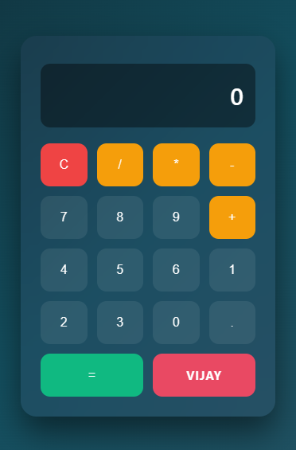

# 🧮 Calculator Web App

A modern and responsive calculator built using HTML, CSS, and JavaScript.  
Performs real-time arithmetic operations with a clean and minimal UI.

---

## 🚀 Features

- Real-time calculations
- Responsive design (works on different screen sizes)
- Clean glassmorphism UI
- Interactive button feedback (hover & click effects)
- Error handling for invalid inputs

---

## 🛠️ Tech Stack

- HTML (Structure)
- CSS (Styling & Layout - Flexbox & Grid)
- JavaScript (Logic & Functionality)

---

## 📸 Preview

---

## 🌐 Live Demo

👉 https://vijay-kumar0.github.io/calculator/

---

## 📂 Project Structure
calculator/
│── index.html
│── style.css
│── script.js

---

## ⚡ How to Run Locally

1. Download or clone the repository  
2. Open `index.html` in your browser  

---

## 🧠 What I Learned

- DOM manipulation using JavaScript  
- Handling user input dynamically  
- Building responsive layouts using CSS Grid & Flexbox  
- Managing UI state (history & result display)

---

## 👤 Author

**Vijay Kumar**
